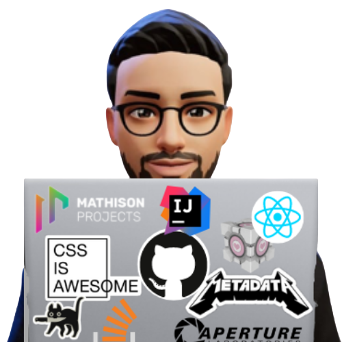

## <h1 align="center"> Hi I'm Ahmed Farrag 👋 [Addy][website]   </h1>
<h3 align="center">A passionate Developer from Egypt</h3>

    

 

	
 

## 📩 Connect with me

      

      

	
	
	

<h3 align="left">Languages and Tools:</h3>

    
## 📊 Github Stats

   
  

    
	  
 
     
<!-- <table width="100%">
  <tr>
    <td width="60%">
      
&nbsp;

    </td>
    <td width="40%">
      

    </td>
  </tr>
</table>     -->
    

[website]: https://ahmedfarrag.vercel.app/

    
    
    
<!--     
**Ahmed-Farrag/ahmed-farrag** is a ✨ _special_ ✨ repository because its `README.md` (this file) appears on your GitHub profile.

Here are some ideas to get you started:

- 🔭 I’m currently working on ...
- 🌱 I’m currently learning ...
- 👯 I’m looking to collaborate on ...
- 🤔 I’m looking for help with ...
- 💬 Ask me about ...
- 📫 How to reach me: ...
- 😄 Pronouns: ...
- ⚡ Fun fact: ...
 -->
